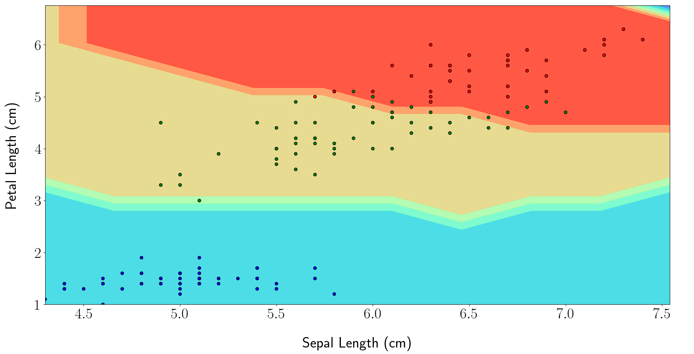
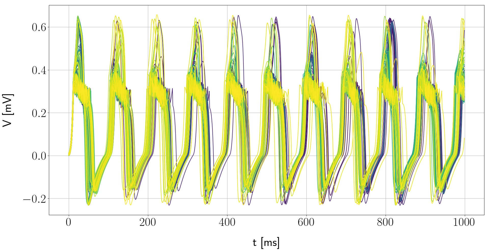
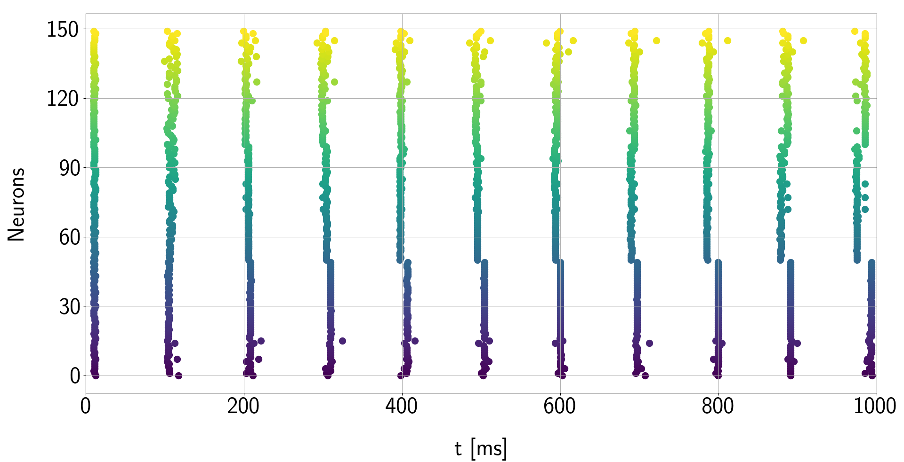

# Master's Project
--------------------
This repository contains the files of my master's research project in computational intelligence. 

The project is a research on the synchronization analysis of biological neuron models. The ideia is to analyze the possibility of trajectories segmentation by synchronizing a group of neurons with strong coupling force between each one and the dessynchronization of those by a weak coupling force. Finally, a proof of concept is created as a machine learning model of semi-supervised learning, thus representing samples with the same classification by a cluster of synchronized neurons, and the samples with different labels are dessynchronized.

<h2> Project Tree </h2>
<pre>
<code>
    masters-project 
    |
    |---- data
    |---- imgs
    |---- nsc
    |---- tests
</code>
</pre>

The <b>data</b> folder contain the raw and cleaned datasets used to test the semi-supervised learning model, as much as the scores obtained by testing the model with different parameters combinations.   
The <b>imgs</b> folder contain the three images used in the <i>README.md</i> file. The <b>nsc</b> package, which is an abbreviation for Neuron Synchronization Competition, contain the python files for the model of semi-supervised learning (<i>neurongraph.py</i>), while it contain others files that calculates the phases of the trajectories to detect the synchronization (<i>unwrap.py</i>), the file to plot some specific kinds of graphics (<i>ngplot.py</i>), different models of self-training (<i>standard_self_training.py</i>) and tri-training (<i>tri_training.py</i>), etc.  
Also there is the neuron subdirectory that contains the biological neuron models defined below:

<ul>
    <li>Hodgkin-Huxley</li>
    <li>Hindmarsh-Rose</li>
    <li>Integrate-and-Fire</li>
    <li>Rulkov</li>
    <li>Izhikevich</li>
    <li>Courbage-Nekorkin-Vdovin</li>
</ul>

Finally, the <b>tests</b> folder contain all the steps made in the project and the figures obtained as the results. Some subdirectories, specifically the last one, must be updated, which will be in a recent future.

<h2></h2>
<h2>Example of Iris Dataset Classification</h2>

The first figure represents the decision limits generated by the adjusted model, while the second image shows the action potential of the neurons of the 150 samples, and we can see the clustering phenomenon by segmenting the trajectories in time in the third image, which represents the times when neural firing occurs.

<h2>Bibliography</h2>

<cite>Hodgkin, A. L., & Huxley, A. F. (1952). A quantitative description of membrane current and its application to conduction and excitation in nerve. The Journal of physiology, 117(4), 500-544.</cite>
 

<cite>Hindmarsh, J. L. and Rose, R. (1984). A model of neuronal bursting using three coupled
first order differential equations. Proceedings of the Royal society of London. Series B.
Biological sciences, 221(1222):87–102.</cite>
 

<cite>Lapicque, L. (1907). Recherches quantitatives sur l’excitation electrique des nerfs
traitee comme une polarization. Journal de Physiologie et de Pathologie Generalej,
9:620–635.</cite>
 

<cite>Rulkov, N. F. (2002). Modeling of spiking-bursting neural behavior using twodimensional
map. Physical Review E, 65(4):041922.</cite>
 

<cite>Izhikevich, E. M. (2003). Simple model of spiking neurons. IEEE Transactions on
neural networks, 14(6):1569–1572.</cite>
 

<cite>Courbage, M., Nekorkin, V., and Vdovin, L. (2007). Chaotic oscillations in a map-based
model of neural activity. Chaos: An Interdisciplinary Journal of Nonlinear Science,
17(4):043109.</cite>